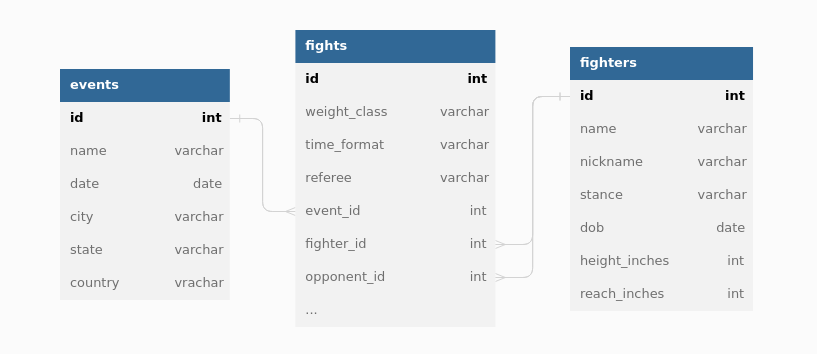
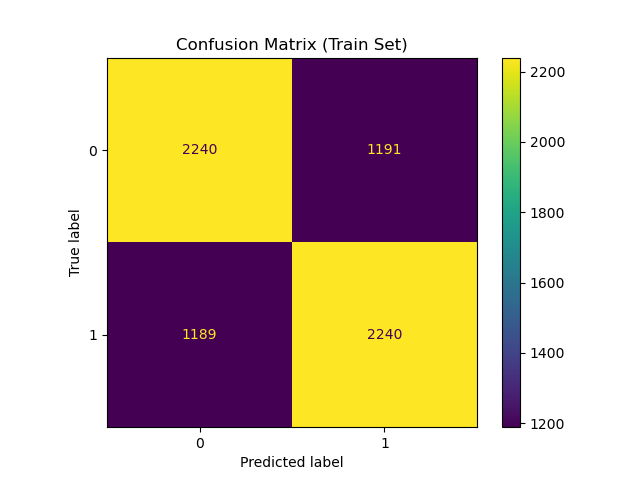
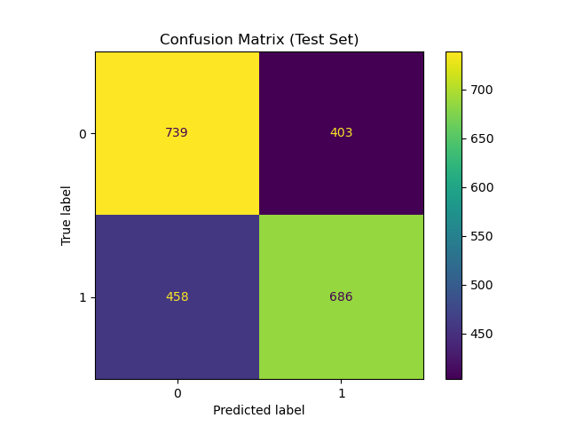

# UFC Fight Predictor

## Table of Contents 

***[Goal](#goal)***

***[1. Data Collection & Cleanse](#1-collect)***

***[2. Feature Engineering](#2-fe)***

***[3. Model Selection](#3-model)***

***[4. Results](#4-results)***

***[Conclusion](#conclusion)***

***[Sources](#sources)***

## Goal <a name="goal" href="#toc">^</a>

Create a machine learning model that can predict fight results with a higher degree of correctness than the baseline.

Mertric of interest: **accuracy**

- since classes are balanced and incorrectly predicting either binary outcome would be equally undesirable

## 1. Data Collection & Cleanse <a name="1-collect" href="#toc">^</a>

### i. Scrape

The data for this project was scraped from [UFCStats](http://ufcstats.com), an unofficial record-keeping site for the UFC.

The scrape consisted of over 11,000 pages on the website.

### ii. Normalization & Joins

Once scraped, the data was normalized into three tables: **events**, **fights**, and **fighters**; which were then cleansed individually.

Once clean, the tables where joined together to form a large table of fight details.

### iii. Reshape

Since rows consist of each fight's details (`date`, `fighter_id`, `opponent_id`, `fight_fighter_win`, ...), to simplify further processing, the table was reshaped so that each row was split in two, one for each contestant's (fighter and opponent) fight details (`date`, `fighter_id`, `fight_fighter_win`, ...).

## 2. Feature Engineering <a name="2-fe" href="#toc">^</a>

### i. Cumulative sum of wins, losses, winrate

Since one might intuitively consider that the best predictor of a fighter's future performance is their past performance, the first set of features that were added were the cumulative wins, losses, and winrate of the fighter, up till the date of each fight.

### ii. By round, method, opponent's stance

In a similar vein, features consisting of cumulative wins, losses, and winrate by round, method (KO, TKO, Submission, ...), opponent's stance (othodox, southpaw, ...) were added.

### iii. Rolling sums of wins, losses, winrate

Additionally n-fight rolling sums of wins, losses, and winrate were added for `n in [1, 3, 5, 10, 20]` to measure the fighter's recent performance at the time of the fight.

### iv. Win/Lose streaks

Another measure of recent performance that was added is a fighter's winning or losing streak at the date of each fight.

### v. Cumulative means of fight stats

A number of per fight stats including number of knockdowns and significant strikes were also available. Using that, cumulative means of these fight stats were created to reflect each fighter's average performance up till the date of each fight.

## 3. Model Selection <a name="3-model" href="#toc">^</a>

### i. Train/Test Split

Before model training, the data was split into train (*n=6860, p=0.75*) and test (*n=2286, 0.25*) sets. The train set will be used to train and optimize the model and the test set will be used to evaluate only the best model.

### ii. Model Selection (Feature Selection & Hyperparameter Tuning)

To find the optimal model, a number of difference machine learning algorithmns were tested. For each model, a pipeline was created to scale the data, select the k best features (where k is a hyperparameter to be optimized), and perform hyperparamater tuning. To perform hyperparameter tuning, the pipeline was subject to 3-fold cross validation, attempting to find the paramaters that maximized accuracy.

The best model was a **Logistic Regression** model with **360** **features**, which had a 5-fold cross validated accuracy of: **0.6089** (60.89%).

## 4. Results <a name="4-results" href="#toc">^</a>

### i. Feature Importances

Looking at the coefficients of the Logistic Regression model, these features seem to be some of the most important one:

<table class="dataframe" border="1">
  <thead>
    <tr>
      <th>feature</th>
      <th>feature_coef</th>
    </tr>
  </thead>
  <tbody>
    <tr>
      <th>opponent_age</th>
      <td>1.499032</td>
    </tr>
    <tr>
      <th>fighter_reach_inches</th>
      <td>1.068637</td>
    </tr>
    <tr>
      <th>fighter_win_streak</th>
      <td>0.85252</td>
    </tr>
    <tr>
      <th>fighter_rollsum10_wins</th>
      <td>0.828116</td>
    </tr>
    <tr>
      <th>opponent_method_decision_split_wins</th>
      <td>0.779593</td>
    </tr>
    <tr>
      <th>opponent_rollsum3_losses</th>
      <td>0.658653</td>
    </tr>
    <tr>
      <th>opponent_rollsum3_wins</th>
      <td>0.631909</td>
    </tr>
    <tr>
      <th>fighter_cumsum_winrate</th>
      <td>0.516765</td>
    </tr>
    <tr>
      <th>fighter_rollsum20_winrate</th>
      <td>0.497244</td>
    </tr>
    <tr>
      <th>opponent_cumsum_round3_winrate</th>
      <td>0.489205</td>
    </tr>
    <tr>
      <th>...</th>
      <td>...</td>
    </tr>
    <tr>
      <th>fighter_cumsum_round3_winrate</th>
      <td>-0.489205</td>
    </tr>
    <tr>
      <th>opponent_rollsum20_winrate</th>
      <td>-0.497244</td>
    </tr>
    <tr>
      <th>opponent_cumsum_winrate</th>
      <td>-0.516765</td>
    </tr>
    <tr>
      <th>fighter_rollsum3_wins</th>
      <td>-0.631909</td>
    </tr>
    <tr>
      <th>fighter_rollsum3_losses</th>
      <td>-0.658653</td>
    </tr>
    <tr>
      <th>fighter_method_decision_split_wins</th>
      <td>-0.779593</td>
    </tr>
    <tr>
      <th>opponent_rollsum10_wins</th>
      <td>-0.828116</td>
    </tr>
    <tr>
      <th>opponent_win_streak</th>
      <td>-0.85252</td>
    </tr>
    <tr>
      <th>opponent_reach_inches</th>
      <td>-1.068637</td>
    </tr>
    <tr>
      <th>fighter_age</th>
      <td>-1.499032</td>
    </tr>
  </tbody>
</table>

**Age**

- A fighter's age seems to be the feature that has the largest negative impact on their chances of winning. So, the younger fighter is more likely to win. After calculating, the younger fighter is has a **57.71%** chance of winning.

**Reach**

- Another important variable is the fighter's reach, which seems to have a positive impact on the chances of winning. The fighter with the longer reach can reach their opponent, without they themselves getting hit. From the data, the fighter with the longer reach has a **52.47%** chance of winning.

**Win streak & Rolling sums of wins/winrates**

- It seems quite obvious that a good predictor of a fighter's current performance is their past performance, and this is reflected in the feature importances as variables such as win streak, rolling sums of wins and winrates seem to have a positive impact of the fighter's chances of winning.

### ii. Model Evaluation

After having selected the best model, it was then evaluated using the train and test sets, which yielded the following confusion matrices:  

And produced the following table of metrics:

<table class="dataframe" border="1">
  <thead>
    <tr style="text-align: right;">
      <th></th>
      <th>accuracy</th>
      <th>f1_score</th>
      <th>precision</th>
      <th>recall</th>
    </tr>
  </thead>
  <tbody>
    <tr>
      <th>train</th>
      <td>0.6531</td>
      <td>0.6531</td>
      <td>0.6529</td>
      <td>0.6533</td>
    </tr>
    <tr>
      <th>test</th>
      <td>0.6234</td>
      <td>0.6144</td>
      <td>0.6299</td>
      <td>0.5997</td>
    </tr>
  </tbody>
</table>

Thus, based on unseen data, the model seems to have an accuracy of **0.6234** (62.34%).

### iii. Re-train

After evaluating the model with the test set, the model was re-trained using all the available data (train + test sets).

### iv. Further Improvements

To improve the performance of the model, more feature engineering can be performed to add certain features:

- ELO Rating
  
  - An overall measure of a fighter's past performance  

> A player's Elo rating is represented by a number which may change depending on the outcome of rated games played. After every game, the winning player takes points from the losing one. The difference between the ratings of the winner and loser determines the total number of points gained or lost after a game.
> 
> Source: [Elo rating system - Wikipedia](https://en.wikipedia.org/wiki/Elo_rating_system)

- Product & squared variables
  
  - New features that are the products or squares of existing features can be added to gain prediction power from features that work in combination or features whose squares are linearly correlated with the taget. However, doing so will require much greater computing power as the number of features will grow exponentially.

## Conclusion <a name="conclusion" href="#toc">^</a>

Starting out with the goal of creating a model with a higher degree of accuracy than the baseline, this project has been successful as the final model has an accuracy of **0.6234** (62.34%), a **0.1234** (12.34%) increase from the baseline.

## Sources <a name="sources" href="#toc">^</a>

- http://ufcstats.com/
- https://en.wikipedia.org/wiki/Elo_rating_system
- https://c4.wallpaperflare.com/wallpaper/556/917/227/arts-b-w-battle-battles-wallpaper-preview.jpg