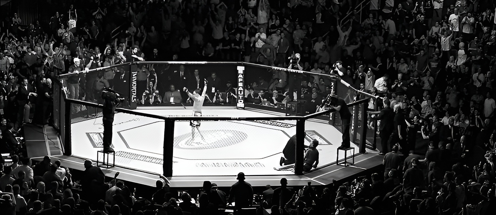

# UFC Fight Predictor

## Table of Contents

***[Goal](#goal)***

***[1. Data Collection & Cleaning](#1-collection)***

***[2. Feature Engineering](#2-fe)***

***[3. Model Training & Evaluation Method](#3-model)***

***[4. Final Results](#4-results)***

***[Conclusion](#conclusion)***

***[Appendix: Exploratory Analysis](#appendix)***

***[Sources](#sources)***

### Goal

Create a machine learning model that can predict fight results with a higher degree of correctness than the baseline.

Mertric of interest: **accuracy**

- since classes are balanced and incorrectly predicting either binary outcome would be equally undesirable

### Data Collection & Cleanse

The data for this project was scraped from [UFCStats](http://ufcstats.com), an unofficial record-keeping site for the UFC.

Once scraped, the data was normalized into three tables: **events**, **fights**, and **fighters**; which were then cleansed individually.

Once clean, the tables where joined together to form a large table of fight details.

### Sources

- https://c4.wallpaperflare.com/wallpaper/556/917/227/arts-b-w-battle-battles-wallpaper-preview.jpg